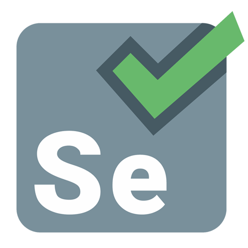

# BiblioHub_QA
## Project Overview:
This is my graduation project after the QA Manual and Automation Tester course in AIT-TR school, Berlin, Germany. I was a part of a student team. My role - QA engineer. 

The goal of my project is automation of testing of the BiblioHub website, created by our team. The project’s initial name was Bibliothèque. Here you can get acquainted with the code
[Backend](https://github.com/Anarchitector/Bibliotheque_backend)
[Frontend](https://github.com/Anarchitector/Bibliotheque_frontend).

BiblioHub was developed as a user-friendly and efficient platform enabling users to comfortably search for books in libraries and reserve books from the library with the most convenient location. Users can search for books by title, author’s name or ISBN. Key features include user registration and authentication, updating user profile, book search, adding to cart and completing book reservation.
## Key Features:
### 1. User Authentication and Roles:
  - Users can register on the platform using email and password.
  - Authentication occurs via entering credentials.
  - User roles are categorized into User, Admin and Library.
### 2. Book search
- All users can perform a book search.
- Users can search for books by title, author’s name or ISBN.
### 3. Book reservation
- All Users can add books to their cart.
- Authenticated Users can complete a reservation.
*****
## Testing Phases:
### 1. Analysis
At the very beginning of the project I created a number of user-story based mind maps and state transition diagrams to visualize how the functionality of the application would work. For this purpose I used tools like ***Miro*** and ***MindMup***. Examples of mind maps and STD:  
[MindMap registration](images/Unregistered_User_registers.png)  
[MindMap login](images/Registered_User_logs_in.png)  
[MindMap book search & reservation](images/Registered_User_books_a_book.png)  
[STD registration](images/STD_registration.png)  
[STD login](images/STD_login.png)  
[STD book search](images/STD_bookSearch.png)

### 2. Planning
In a team we developed a Test Plan, outlining the functions to test, test design techniques, acceptance criteria, and more. Then a Requirement Specification was created with the help of the ***TestLink*** management system.  
[Test plan](https://drive.google.com/file/d/1WsVgYR7H76yXzTCSmeVoLPlB_iPpsDcC/view?usp=drive_link)  
[Requirements spec](https://docs.google.com/document/d/1paCxmm0PGLtlIt26bxyprq1z2ZOXh2kL/edit?usp=drive_link&ouid=115695229689061073439&rtpof=true&sd=true)
### 3. Test design
In a team we wrote over 100 test cases in TestLink, both positive and negative. I also prepared a number of tables for the tests, using test design techniques such as equivalence partitioning and boundary value analysis.   
[Test spec](https://docs.google.com/document/d/1tLP-NSAKJULIRasVYTczwzm7cK4-CYFb/edit)  
[Table positive example](src/test/resources/user.csv)  
[Table negative example](https://github.com/tatjana-lin/Bibliotheque_QA/blob/main/src/test/resources/regNegEmail.csv)

### 4. Implementation 
**UI testing** I automated with the help of ***Selenium*** (design pattern - Page Object Model) and ***TestNG***. Additionally, I used a ***Logger*** and ***Screenshots*** for reports to ensure comprehensive logging of test execution.  
In total I created **125** [UI tests](https://github.com/tatjana-lin/Bibliotheque_QA/tree/main/src/test/java/com/bibliotheque/tests).  
**API testing** was at first completed using ***Postman***
[My Postman Collection](https://github.com/tatjana-lin/Bibliotheque_QA/blob/main/BiblioHub.postman_collection.json)  
and then automated with the help of ***REST Assured*** and ***Lombok*** libraries.  
In total I created **144** [API tests](https://github.com/tatjana-lin/Bibliotheque_QA/tree/main/src/test/java/com/bibliotheque_API/tests).  
I also used ***Jenkins*** for continuous integration (CI).
### 5. Execution & bug reports
As a bug-tracking tool our team used ***Jira***.   
[KAN board](images/KAN_board.png)  
### Bugs Found:🐞
<table>
  <tr>
    <td>

<!-- Первая таблица -->
**UI bugs:**  
| **Bugs Priority** | **Quantity** |
|-------------------|--------------|
| Highest           | 1            |
| High              | 4            |
| Medium            | 12           |
| Low               | 0            |
| **Total:**        | **17**       |

</td>
    <td>

<!-- Вторая таблица -->
**API bugs:**
| **Bugs Priority** | **Quantity** |
|-------------------|--------------|
| Highest           | 0            |
| High              | 4            |
| Medium            | 5            |
| Low               | 0            |
| **Total:**        | **9**        |

</td>
  </tr>
</table>

**Example of the most critical bugs:**  
[BugReport1](https://docs.google.com/document/d/1fm6oByJL-_83cp3Tpso7AhuK6QR2We0D/edit?usp=drive_link&ouid=115695229689061073439&rtpof=true&sd=true)  
[BugReport2](https://docs.google.com/document/d/1Q_yg_3lKb7lPdnJyfLbxkplEQM8uae7h/edit?usp=drive_link&ouid=115695229689061073439&rtpof=true&sd=true)  
[BugReport3](https://docs.google.com/document/d/1voI42JOeFUi-AhGYYHB24LUpp6KlXLMV/edit?usp=drive_link&ouid=115695229689061073439&rtpof=true&sd=true)  

## 6. Results 

All requirements were covered by tests  
[Traceability matrix](images/Traceability_matrix.png)  
Over 260 Autotests were run successfully after fixing the bugs  
[Regression test summary](images/build.png)  
****
## Languages and Tools:

  
  
  
  
  
  
  
  
  
  
  
  
  
  
  

